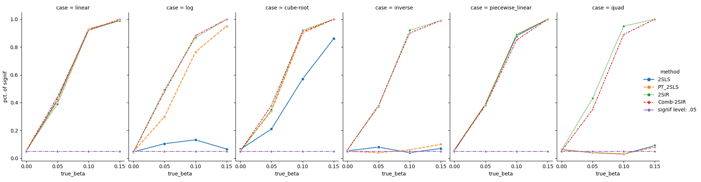

 
[](https://www.python.org/)
[](https://opensource.org/licenses/MIT)

<!-- []()


[]() -->
<!-- [](https://pepy.tech/project/leafmap) -->
<!-- [](https://github.com/giswqs/leafmap/actions?query=workflow%3Abuild) -->

# 🧬 nonlinear-causal <a href="https://github.com/statmlben/nonlinear-causal"></a>

**nonlinear-causal** is a Python module for nonlinear causal inference, including **hypothesis testing** and **confidence interval** for causal effect, built on top of instrument variables and Two-Stage least squares ([2SLS](https://en.wikipedia.org/wiki/Instrumental_variables_estimation)). 

- GitHub repo: [https://github.com/nl-causal/nonlinear-causal](https://github.com/nl-causal/nonlinear-causal)
- PyPi: [https://pypi.org/project/nonlinear-causal/](https://pypi.org/project/nonlinear-causal/)
- Paper: [PMLR@CLeaR2024](https://openreview.net/pdf?id=cylRvJYxYI)
- Documentation: [https://nonlinear-causal.readthedocs.io](https://nonlinear-causal.readthedocs.io/en/latest/index.html)

## Models

**nonlinear-causal** considers two instrument variable causal models:

<a href="https://openreview.net/pdf?id=cylRvJYxYI"></a>

Illustrated by the above image example, let's denote $\mathbf{z}$ as the valid/invalid instrument variables (such as SNPs), $x$ as the exposure (such as gene expression), and $y$ as the outcome (such as AD). 

### **Two-Stage least squares (2SLS)**

$$
\phi(x) = \mathbf{z}^\prime \mathbf{\theta} + w, \quad y = \beta x + \mathbf{z}^\prime \mathbf{\alpha} + \epsilon,
$$

where $(w,\varepsilon)$ are the error terms independent of the instruments $\mathbf{z}$, however, $w$ and $\varepsilon$ may be correlated due to underlying *confounders*, and $\beta\in\mathbb{R}$, $\mathbf{\alpha}\in\mathbb{R}^p$, $\mathbf{\theta}\in\mathbb{R}^p$ are unknown parameters.

### **Two-Stage Sliced Inverse Regression (2SIR)** (a nonlinear extension of 2SLS, see [our paper](https://openreview.net/pdf?id=cylRvJYxYI))

$$
\phi(x) = \mathbf{z}^\prime \mathbf{\theta} + w, \quad y = \beta \phi(x) + \mathbf{z}^\prime \mathbf{\alpha} + \epsilon,
$$

where $(w,\varepsilon)$ are the error terms independent of the instruments $\mathbf{z}$, however, $w$ and $\varepsilon$ may be correlated due to underlying *confounders*, and $\beta\in\mathbb{R}$, $\mathbf{\alpha}\in\mathbb{R}^p$, $\mathbf{\theta}\in\mathbb{R}^p$ are unknown parameters.

**Remarks**
- **2SLS / 2SIR.** $\mathbf{\alpha} \neq \mathbf{0}$ indicates the violation of the second and/or third IV assumptions. 
- **2SIR.** Generally, the effect $\beta\phi(\cdot)$ may not be identifiable with the presence of invalid IVs. In the literature, additional structural constraints are imposed to avoid this issue, such as $\|\mathbf{\alpha}\|_0 < p/2$.
- **2SIR.** $\beta$ and $\phi$ are identifiable by fixing $\|\mathbf{\theta}\|_2 = 1$ and $\beta \geq 0$.

**Strengths** of **2SIR**
- Model assumptions of 2SIR are weaker than the classical 2SLS: the model admits an *arbitrary* nonlinear transformation $\phi(\cdot)$ across $\mathbf{z}$, $x$ and $y$, relaxing the linearity assumption in the standard TWAS/2SLS.
- 2SIR includes 2SLS and Yeo-Johnson power transformation 2SLS (PT-2SLS) as special cases. It is worth mentioning that the proposed method remains competitive against 2SLS/PT-2SLS even if the linear assumption holds.
- The implicit linear structure in both 2SLS and 2SIR allows the *use of GWAS summary data* of our method, in contrast to requiring individual-level data by the other (non-linear) models.

## What We Can Do:

**2SLS**

- Estimate $\beta$: marginal causal effect from $X \to Y$
- Hypothesis testing (HT) and confidence interval (CI) for marginal causal effect $\beta$.

**2SIR**

- Estimate $\beta$: marginal causal effect from $X \to Y$
- Hypothesis testing (HT) and confidence interval (CI) for marginal causal effect $\beta$.
- Estimate nonlinear causal link $\phi(\cdot)$.


## Installation

```bash
# Install the latest version `nonlinear-causal` in Github:
pip install git+https://github.com/nl-causal/nonlinear-causal
# or Install `nonlinear-causal` lib from `pypi`
pip install nonlinear-causal
```

## Examples and notebooks

- [User Guide](./docs/source/md/user_guide.md)
- [Simulation for HT and CI with standard setup](./nb/sim_main.ipynb)
- [Simulation for HT and CI with invalid IVs](./nb/sim_invalid_IVS.ipynb)
- [Simulation for HT and CI with categorical IVs](./nb/sim_cate.ipynb)
- [Real application](app_test.ipynb)

## Simulation Performance
- We examine four cases: (i) $\beta = 0$, (ii) $\beta = .05$, (iii) $\beta = .10$, (iv) $\beta = .15$. Note that case (i) is for Type I error analysis, while $\beta > 0$ in (ii) - (iv), suggests power analysis. 

- Six transformations are considered: (1) linear: $\phi(x) = x$; (2) logarithm: $\phi(x) = \log(x)$; (3) cube root: $\phi(x) = x^{1/3}$; (4) inverse: $\phi(x) = 1/x$; (5) piecewise linear: $\phi(x) = xI(x\leq 0) + 0.5 x I(x > 0)$; (6) quadratic: $\phi(x) = x^2$.  



For more information, please check [our paper](https://openreview.net/pdf?id=cylRvJYxYI) (Section 3) or the [Jupyer Notebook](./nb/sim_main.ipynb) for the simulation examples.

## Reference

If you use this code please star 🌟 the repository and cite the following paper:

- Dai, B., Li, C., Xue, H., Pan, W., & Shen, X. (2024). Inference of nonlinear causal effects with GWAS summary data. In *Conference on Causal Learning and Reasoning*. PMLR.

```latex
@inproceedings{dai2022inference,
  title={Inference of nonlinear causal effects with GWAS summary data},
  author={Dai, Ben and Li, Chunlin and Xue, Haoran and Pan, Wei and Shen, Xiaotong},
  booktitle={Conference on Causal Learning and Reasoning},
  pages={},
  year={2024},
  rganization={PMLR}
}
```

⚖️ License

**nonlinear-causal** is open source under the MIT license.